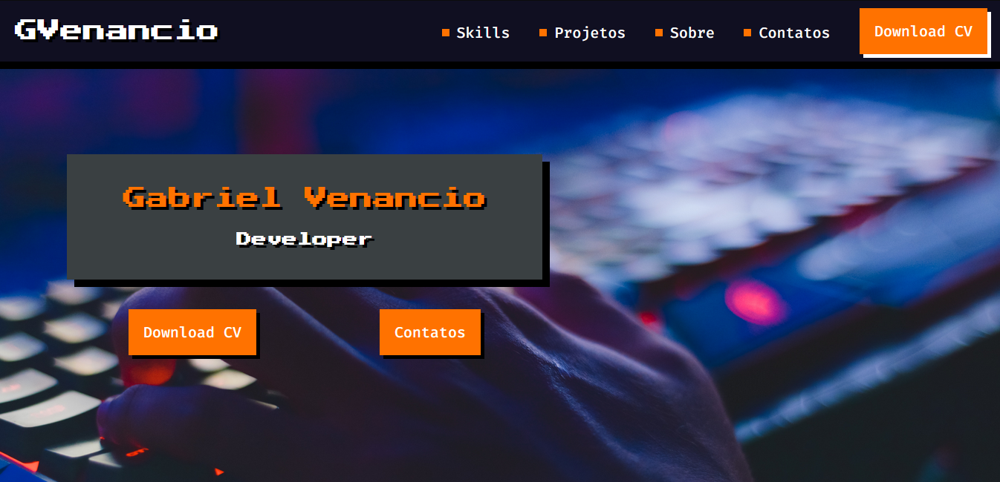

Landing Page do meu Porfólio

<h1 align="center">
  
</h1>

## Objetivo

Criar uma landing page do meu portfólio, colocando em prática minhas habilidades em HTML, CSS  e JS.

## Pré-requisitos

Para visualizar o site em sua máquina, você só precisa ter um navegador de sua preferência, depois de fazer o Git Clone.
Além disto é bom ter um editor para trabalhar com o código como [VSCode](https://code.visualstudio.com/)

## Tecnologias

As seguintes ferramentas foram usadas na construção do projeto:

- HTML
- CSS
- JS

## Licença

This project could be used by anyone! MIT License

## Autor
Feito com ❤️ por Gabriel Venancio 
